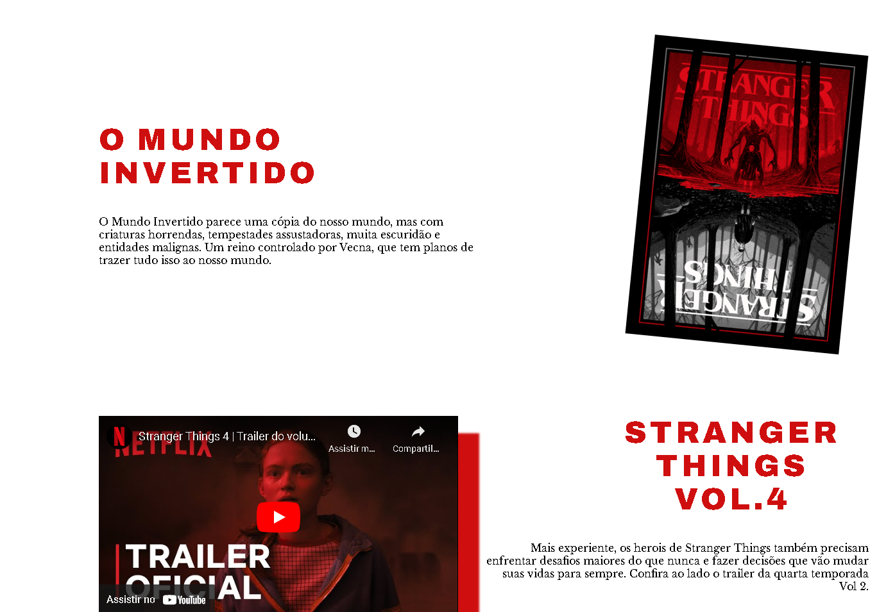
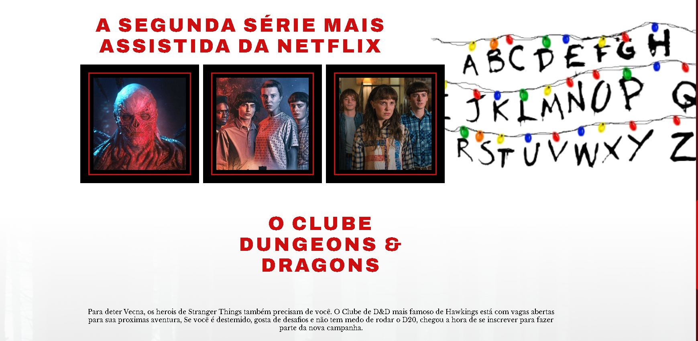
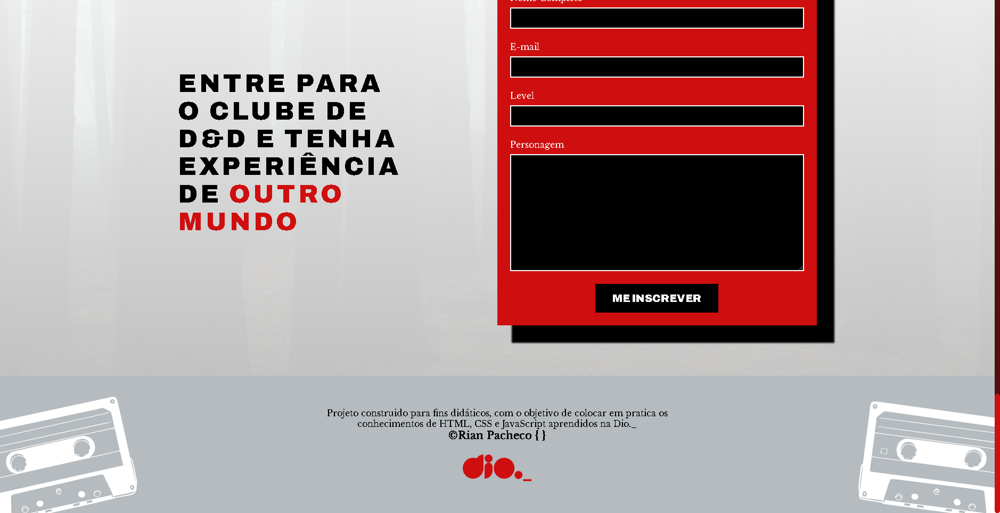
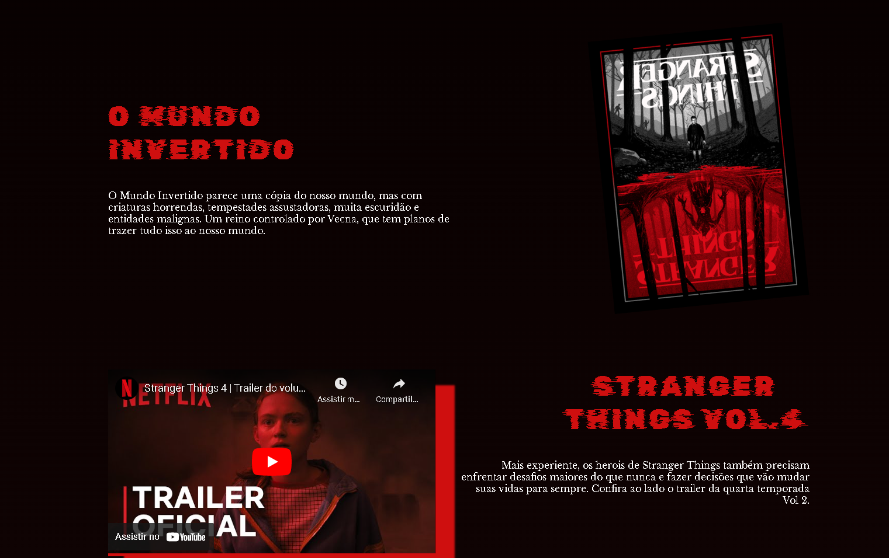
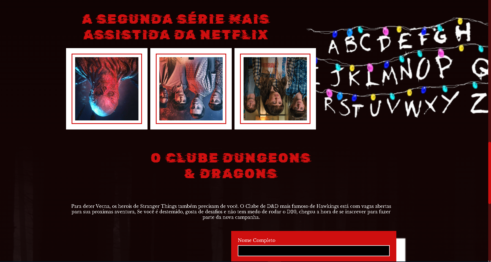
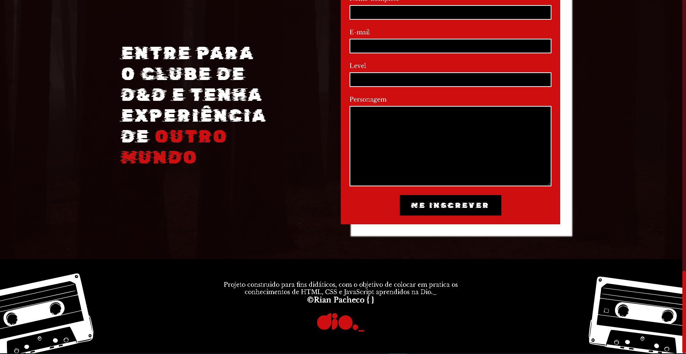

# Mundo-Invertido &copy; Rian Pacheco 🚀

### link do projeto - https://rianpacheco.github.io/Mundo-Invertido/

 Projeto feito 100% para didática e colocar em pratica as tecnologias em front-end.

 Projeto feito do Evento Mundo Invertido da Plataforma DIO (Digital Innovation One)
 
 Ótimo projeto para treinar as habilidades com interfaces modernas e interativas..

## 📊 Preview

# 💻 Tecnologias utilizadas

## 🔅 Front end
- HTML
- CSS
- JAVASCRIPT

## 🔏 BANCO DE DADOS
- FIREBASE
- FIRESTORE

## 🌐 Implantação em produção
- Front end web: GitHub.Io

# © Autor

&copy; <a href="https://www.linkedin.com/in/rian-pacheco/"> Rian Pacheco</a>

